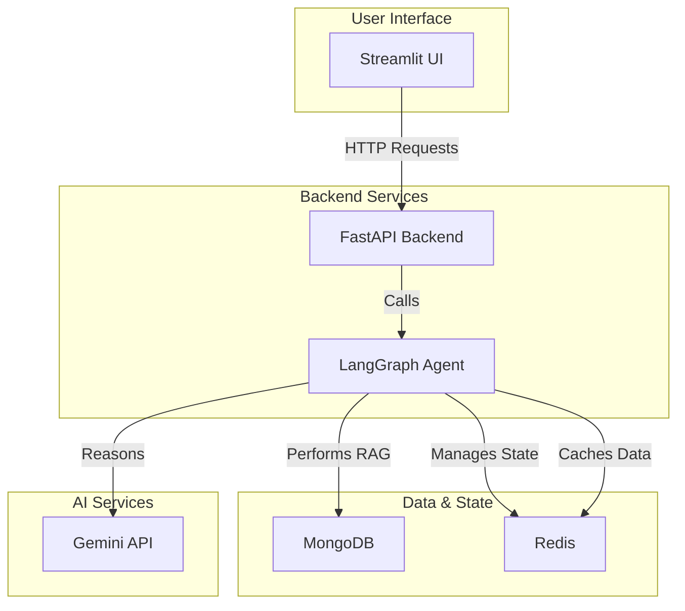

# CareerPilot: Autonomous Multimodal Job Application Agent

CareerPilot is a cloud-native, agentic AI system designed to streamline the job application process. Powered by Gemini, LangGraph, and a modern Python stack, it analyzes resumes, job descriptions, and even video scrolls to provide a comprehensive skill-match analysis, generate tailored insights, and help job seekers prepare for interviews.

## Core Features

-   **Multimodal Input:** Accepts resumes and job descriptions in various formats (PDF, DOCX, text).
-   **Agentic Workflows:** Utilizes LangGraph for multi-step reasoning, planning, and execution.
-   **FitGraph Engine:** Visualizes the alignment between a candidate's skills and a job's requirements.
-   **RAG Pipeline:** Grounds insights and suggestions using a Retrieval-Augmented Generation pipeline with MongoDB Atlas Vector Search.
-   **Cloud-Native & Containerized:** Built as a set of microservices, containerized with Docker, and ready for Kubernetes deployment.

## Tech Stack

| Category                   | Technology                                    |
| -------------------------- | --------------------------------------------- |
| **Core Application**       | Python 3.10+, FastAPI, Streamlit, LangGraph |
| **AI & Multimodal**        | Gemini API                                    |
| **Vector Search & RAG**    | MongoDB Atlas Vector Search                   |
| **State, Cache & Queues**  | Redis                                         |
| **Containerization**       | Docker & Docker Compose                       |
| **Orchestration**          | Kubernetes                                    |

## System Architecture

CareerPilot is architected as a set of communicating microservices, ensuring scalability and separation of concerns.



-   **Streamlit UI:** The primary user interface for uploading documents and viewing analysis.
-   **FastAPI Backend:** The central API that handles requests, orchestrates workflows, and communicates with other services.
-   **LangGraph Agent:** The "brain" of the application, responsible for planning, RAG, and generating insights.
-   **MongoDB:** The primary data store for logs, sessions, and the vector store for the RAG pipeline.
-   **Redis:** Used for caching, session management, and as a message broker for agent state.
-   **Gemini API:** Provides the multimodal reasoning and generation capabilities.

## Project Structure

The `app/` directory contains the core application logic, organized by service:

```
app/
├── agent/            # LangGraph agent for planning and execution
│   ├── fitgraph.py
│   └── workflow.py
├── api/              # FastAPI backend server
│   ├── schemas.py
│   └── server.py
├── gemini/           # Service for interacting with the Gemini API
│   ├── prompts/
│   └── service.py
├── rag/              # RAG pipeline with MongoDB Vector Search
│   ├── ingest.py
│   └── mongo_vector.py
├── ui/               # Streamlit frontend application
│   ├── components/
│   └── views/
└── utils/            # Shared utility functions
    ├── logger.py
    └── mongo_handler.py
```

## Getting Started

### Prerequisites

-   Docker and Docker Compose
-   Python 3.10+
-   A Gemini API Key

### Running Locally with Docker Compose

This is the recommended method for running CareerPilot locally.

1.  **Clone the repository:**
    ```bash
    git clone <repository-url>
    cd CareerPilot
    ```

2.  **Create a `.env` file:**
    Create a `.env` file in the root of the project and add your Gemini API key:
    ```
    GEMINI_API_KEY="your-gemini-api-key"
    ```

3.  **Build and run the services:**
    Navigate to the `infra/docker` directory and run Docker Compose:
    ```bash
    cd infra/docker
    docker-compose up --build
    ```

This will start all the necessary services:
-   **UI:** `http://localhost:8501`
-   **API:** `http://localhost:8000`
-   **MongoDB:** `mongodb://localhost:27017`
-   **Redis:** `redis://localhost:6379`

## API Endpoints

The FastAPI backend exposes the following endpoints:

| Method | Endpoint              | Description                                        |
| ------ | --------------------- | -------------------------------------------------- |
| `GET`  | `/health`             | Health check for the API service.                  |
| `POST` | `/analyze`            | Analyzes a resume and job description.             |
| `POST` | `/evaluate_answer`    | Evaluates a user's answer to an interview question.|
| `POST` | `/rag/search`         | Performs a search in the RAG pipeline.             |
| `POST` | `/rag/ingest`         | Ingests a new document into the vector store.      |
| `POST` | `/stream/analyze`     | Streams the analysis of a resume and JD.           |
| `POST` | `/stream/evaluate`    | Streams the evaluation of a user's answer.         |

## How to Contribute

We welcome contributions! Please follow our [Branching Strategy](BRANCHING_STRATEGY.md) and open a pull request for any new features or bug fixes.

## License

This project is licensed under the MIT License. See the [LICENSE](LICENSE) file for details.
