# **📊 Performance Metrics (Structured Table)**

### **Raw Events Provided**
```
('agent_workflow_started', 0)
('cache_checked', 1)
('jd_embedded_for_search', 1399)
('vector_search_complete', 1586)
('knowledge_generated', 21248)
('knowledge_embedded_for_ingestion', 22635)
('knowledge_ingested', 22813)
('final_analysis_complete', 58962)
('final_result_cached', 58965)
```

---

# **📘 Clean, Readable Table (with durations)**

| Step                             | Timestamp (ms) | Duration Since Previous (ms) | Component             | Insight                              |
|----------------------------------|----------------|------------------------------|-----------------------|--------------------------------------|
| agent_workflow_started           | 0              | —                            | Agent                 | Workflow begins                      |
| cache_checked                    | 1              | **1**                        | Redis                 | Cache lookup is instant (excellent)  |
| jd_embedded_for_search           | 1399           | **1398**                     | Gemini Embedding      | Embedding is fast (<1.4s)            |
| vector_search_complete           | 1586           | **187**                      | MongoDB Vector Search | Very fast (<200ms)                   |
| knowledge_generated              | 21248          | **19662**                    | Gemini LLM            | ⚠️ **Major bottleneck**              |
| knowledge_embedded_for_ingestion | 22635          | **1387**                     | Gemini Embedding      | Normal                               |
| knowledge_ingested               | 22813          | **178**                      | MongoDB Upsert        | Very fast                            |
| final_analysis_complete          | 58962          | **36149**                    | Gemini LLM            | ⚠️ **Second major bottleneck**       |
| final_result_cached              | 58965          | **3**                        | Redis                 | Instant                              |

---

# **📌 High‑Level Summary**

### **🚀 Fast Operations**
- Redis cache check: **1ms**
- Vector search: **187ms**
- Knowledge ingestion: **178ms**
- Redis write: **3ms**

These components are extremely efficient.

---

### **⚠️ Moderate Operations**
- Embedding JD: **1.4 seconds**
- Embedding generated knowledge: **1.3 seconds**

These are normal for embedding models.

---

### **🔥 Critical Bottlenecks (Where Google Needs to Help)**

| Operation                | Duration      		| Why it matters                                           |
|--------------------------|--------------------|----------------------------------------------------------|
| **Knowledge generation** | **19.6 seconds** 	| Gemini is slow generating long-form structured knowledge |
| **Final analysis** 	   | **36.1 seconds** 	| Gemini is slow processing combined context + resume + JD |

Total Gemini LLM latency:  
**≈ 56 seconds** (19.6 + 36.1)

This is the **core reason** my end‑to‑end analysis takes ~1 minute.

---

---

# 📊 **Performance Metrics (Run #2 — Structured Table)**

| Step                             | Timestamp (ms) | Duration Since Previous (ms) | Component             | Insight                              |
|----------------------------------|----------------|------------------------------|-----------------------|--------------------------------------|
| agent_workflow_started           | 0              | —                            | Agent                 | Workflow begins                      |
| cache_checked                    | 4              | **4**                        | Redis                 | Instant (excellent)                  |
| jd_embedded_for_search           | 1387           | **1383**                     | Gemini Embedding      | Fast, consistent with previous run   |
| vector_search_complete           | 2734           | **1347**                     | MongoDB Vector Search | Very fast                            |
| knowledge_generated              | 22342          | **19608**                    | Gemini LLM            | ⚠️ Major bottleneck                  |
| knowledge_embedded_for_ingestion | 23679          | **1337**                     | Gemini Embedding      | Normal                               |
| knowledge_ingested               | 23875          | **196**                      | MongoDB Upsert        | Very fast                            |
| final_analysis_complete          | 60242          | **36367**                    | Gemini LLM            | ⚠️ Second major bottleneck           |
| final_result_cached              | 60246          | **4**                        | Redis                 | Instant                              |

---

# 📈 **Comparison With Previous Run**

### **Previous Run**
- Knowledge generation: **19.6 sec**
- Final analysis: **36.1 sec**
- Total Gemini LLM time: **~56 sec**

### **This Run**
- Knowledge generation: **19.6 sec**
- Final analysis: **36.3 sec**
- Total Gemini LLM time: **~56 sec**

### ✔️ **Conclusion: pipeline is stable and consistent.**

The variance between runs is **< 1%**, which is excellent for performance analysis.

---

# 🔥 **Where the Time Is Actually Going**

Let’s visualize the distribution:

| Component                                   | Total Time (ms) | % of Total |
|---------------------------------------------|-----------------|------------|
| Redis (cache check + write)                 | 8               | 0.01%      |
| Embedding (JD + knowledge)                  | 2720            | 4.5%       |
| Vector search + ingestion                   | 1543            | 2.5%       |
| **Gemini LLM (knowledge + final analysis)** | **55975**       | **93%**    |

### ✔️ **93% of total latency is Gemini LLM generation.**  
This is the core bottleneck.

# 🔍 **Cross‑Run Comparison (All 3 Runs)**

| Run 		| Knowledge Generation (ms) | Final Analysis (ms) | Total Gemini Time | Total Pipeline Time |
|-----------|---------------------------|---------------------|-------------------|---------------------|
| Run #1 	| 21248 					| 58962 			  | 80210 			  | ~59 sec 			|
| Run #2 	| 22342 					| 60242 			  | 82584 			  | ~60 sec 			|
| Run #3 	| 18980 					| 50403 			  | 69383 			  | ~50 sec 			|


# **📈 Visual Timeline (Mermaid Gantt)**

Mermaid‑enabled Markdown viewer:

```mermaid
gantt
    title Resume vs JD Analysis Latency Breakdown
    dateFormat  X
    axisFormat  %L ms

    section Fast Steps
    Cache Check                 :done, 1, 1
    Vector Search               :done, 1399, 187

    section Embedding
    JD Embedding                :done, 1, 1398
    Knowledge Embedding         :done, 21248, 1387

    section Gemini LLM (Slow)
    Knowledge Generation        :crit, 1586, 19662
    Final Analysis              :crit, 22813, 36149

    section Finalization
    Cache Write                 :done, 58962, 3
```



---

# **🧠 Insights to Google**

### **1. Gemini LLM is the dominant latency source**
- 56 seconds out of 59 seconds  
- 94% of total runtime

### **2. Embedding + vector search + ingestion are negligible**
- Combined < 3 seconds

### **3. Redis caching is extremely effective**
- Cache hit would reduce total time from **59 seconds → < 2 seconds**

### **4. Two Gemini calls are the problem**
- `generate_knowledge` (19.6s)
- `final_analysis` (36.1s)

### **5. This is a perfect case study**

- Prompt size  
- Token count  
- Model used  
- Latency per call  
- Opportunities for optimization  

Google engineers will need to solve this issue with this level of detail.

---

### **1. Why does Gemini take 20–36 seconds for long‑form generation?**
Ask about:
- Tokenization overhead  
- Model selection  
- Latency variance  
- Internal queueing  

### **2. Is there a faster model for structured analysis?**
Maybe:
- Gemini Flash  
- Gemini Pro with streaming  
- Gemini Nano for partial tasks  

### **3. Can we reduce prompt size using document references?**
Instead of sending full resume + JD + context.

### **4. Can Gemini support partial streaming for long responses?**
To reduce perceived latency.

### **5. Is there a recommended architecture for multi‑step analysis?**
This workflow is perfect for Gemini feedback.


# 🧩 **What This Means for our Architecture**

Our pipeline is already optimized everywhere **except** the Gemini LLM calls.

This is exactly what we want to show Google:

- we’ve isolated the bottleneck  
- We’ve measured it precisely  
- We’ve validated it across multiple runs  
- We’ve eliminated all other sources of latency  

This gives us a **bulletproof case study**.

