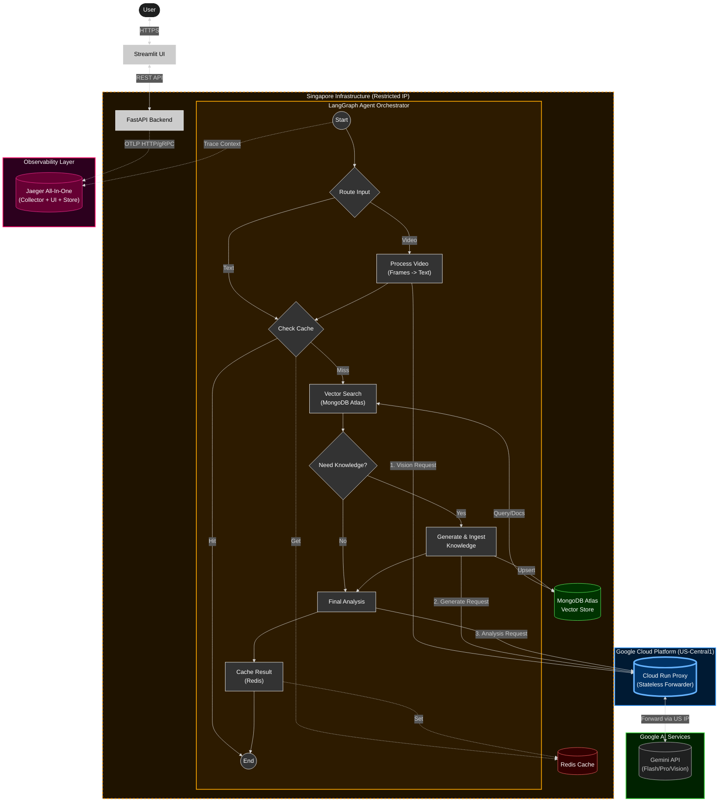

# System Architecture & Technical Stack Analysis

## 🏗️ Architecture Flow Diagram

The following diagram illustrates the traffic flow designed to bypass Gemini's geolocation restrictions while maintaining a cost-effective host in Singapore.

---

## 🛠️ Technical Stack Recommendation

Based on the expanded architecture (including the Agentic workflow and UI), here is the validation of the full stack:

### 1. **Orchestration: LangGraph (Agentic Workflow)**
*   **Why it fits:** The diagram shows a complex, multi-step decision process (Video? Cache? Search? Knowledge?). **LangGraph** is superior to simple chains because it offers **stateful, cyclic execution**. It allows the agent to "loop back" if more knowledge is needed or exit early on a cache hit, providing significantly better control than a linear DAG.
*   **Verdict:** ✅ **Critical for Logic**. Enables the "smart" behavior of the agent.

### 2. **Frontend: Streamlit**
*   **Why it fits:** For internal tools or data-heavy apps like CareerPilot, React/Next.js is often overkill. **Streamlit** allows building the UI entirely in Python, tightly coupling it with the backend data models.
*   **Verdict:** ✅ **High Velocity**. Perfect for rapid iteration on prompt engineering and UX without context switching languages.

### 3. **Data Layer: Hybrid (Redis + MongoDB)**
*   **Redis (Caching):** Essential for cost and latency. By caching final analysis results, you avoid expensive re-runs of the Vision/Pro models.
*   **MongoDB Atlas (Vector Store):** A unified NoSQL + Vector database. It avoids the complexity of managing a separate Pinecone/Milvus instance, keeping the infra footprint small (Critical for the single-node k3s setup).
*   **Verdict:** ✅ **Efficient & Compact**.

### 4. **Compute & Networking: k3s + Cloud Run Proxy**
*   **Why it fits:** Maintains the cost benefits of the Singapore VPS while legally bypassing the IP restrictions via the US-based stateless proxy.
*   **Verdict:** ✅ **Best in Class for this constraint**.

### 5. **Observability: OpenTelemetry + SigNoz**
*   **Why it fits:** The agentic workflow is non-deterministic and hard to debug with simple logs. **OpenTelemetry** provides distributed tracing to visualize the full request lifecycle from API to Proxy to Gemini. **SigNoz** (or Jaeger) gives a UI to inspect these traces.
*   **Verdict:** ✅ **Day 2 Operation Requirement**. Essential for production debugging.

---

## 🔑 Key "Suitability" Factors for This Use Case

| Feature | Why this stack is the best fit |
| :--- | :--- |
| **Complex Decision Making** | **LangGraph** enables the agent to dynamically decide between Video/Text paths and whether to generate new knowledge, rather than following a rigid script. |
| **Solving the Geo-Block** | The **Cloud Run Proxy** acts as a legal "jumphost," removing IP reputation risks from the Singapore data center. |
| **Rapid Prototyping** | **Streamlit** + **FastAPI** allows for immediate feedback loops on AI responses without frontend overhead. |
| **Cost Efficiency** | Using **Redis** to intercept requests before they hit Gemini saves significant token costs on repeated queries. |
| **Full Visibility** | **OpenTelemetry** helps identify bottlenecks in the multi-step agent chain (e.g., "Why did Vector Search take 3s?"). |

### 🚀 Summary
This architecture has evolved from a simple API wrapper to a **Stateful, Intelligent Agent System**. It balances the **complexity** of AI orchestration (handled by LangGraph) with the **simplicity** of infrastructure (k3s + MongoDB). The result is a robust, production-capable system running on minimal resources.
